# TCMP 用例管理平台 · 用户手册

> 适用版本：v1.0（含 2026-09-03 更新）　|　访问地址：`http://192.168.18.151/` 或 `http://192.168.20.127/`
> 推荐浏览器：Chrome / Edge 最新版

---

## 目录

1. [快速开始](#1-快速开始)
2. [核心概念](#2-核心概念)
3. [注册与登录](#3-注册与登录)
4. [工作台](#4-工作台)
5. [用例集管理](#5-用例集管理)
6. [项目管理](#6-项目管理)
7. [测试轮次](#7-测试轮次)
8. [执行用例](#8-执行用例)
9. [用例评审](#9-用例评审)
10. [缺陷管理](#10-缺陷管理)
11. [查看报告](#11-查看报告)
12. [系统管理（管理员）](#12-系统管理员)
13. [常见问题](#13-常见问题)

---

## 1. 快速开始

第一次使用，按下面 5 步即可跑通一个完整测试流程：

```
注册/登录  →  建用例集写用例  →  建项目并添加用例  →  新建轮次并分配  →  执行打结果 → 看报告
```

登录成功后默认进入「**工作台**」，可从这里跳转到待执行的轮次或待办评审；也可通过顶部导航进入用例集、项目等模块。

---

## 2. 核心概念

| 概念 | 说明 |
|------|------|
| **用例集（CaseSet）** | 用例的“仓库”，按模块树组织，可跨项目复用。 |
| **用例（Case）** | 单条测试用例，含前置条件、步骤、测试数据、预期结果、等级等。 |
| **项目（Project）** | 一次测试工作的载体，从用例集挑选用例进“用例池”。 |
| **用例池** | 项目内已纳入的用例集合，轮次从这里挑选用例。 |
| **测试轮次（Round）** | 一次完整执行，绑定被测软件版本，可筛选用例并分配给成员。 |
| **执行结果** | P=通过 / F=失败 / B=阻塞 / NP=不通过(不适用) / NT=未测试。 |
| **缺陷（Defect）** | 执行失败时登记的问题，可关联 Teambition 任务。 |

> 关系：`用例集` 提供用例 → `项目` 选入用例池 → `轮次` 筛选并分配 → `执行` 记录结果 → `报告` 汇总。

---

## 3. 注册与登录

### 3.1 注册

1. 打开 `http://192.168.18.151/`，点击登录页下方「**没有账号？立即注册**」。
2. 填写**邮箱、姓名、手机号、密码**，提交即可（无需验证码）。
3. 注册成功后自动跳转登录页。

> ⚠️ 邮箱需使用公司域名 `@mech-mind.net`。

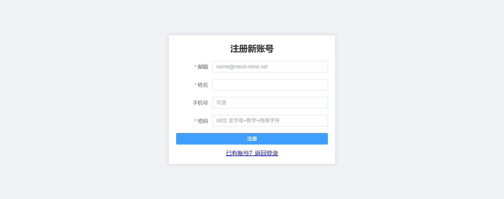

### 3.2 登录

输入邮箱与密码 → 点「登录」。登录成功后进入「**工作台**」（不再默认进入项目列表）。

直接访问平台首页（如 `http://192.168.18.151/`）也会进入工作台。若他人分享的具体链接（某个项目、某条评审等），仍可**直达该页**，不会被强制跳转。

右上角点击**用户名 ▾** 可「退出登录」。

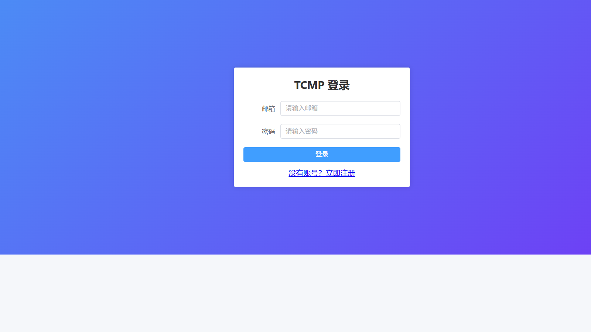

---

## 4. 工作台

顶部导航点击「**工作台**」进入（也是登录后的默认首页）。

工作台聚合两类待办：

| 区域 | 内容 |
|------|------|
| **待执行用例** | 你有分配且尚未执行完毕的测试轮次，点行可进入执行页。 |
| **待办评审** | 你作为发起人或评审成员的进行中评审，点行进入评审详情。 |

**排序**：两张表均显示「创建时间」列。默认按创建时间**从新到旧**排列（最新轮次/评审在最前）；点击「创建时间」或「待执行/待办」表头可切换升序/降序。

---

## 5. 用例集管理

顶部导航点击「**用例集**」进入。

### 5.1 用例集项目列表

进入某个用例集项目（如 Vision）后，可看到该项目下的用例集列表：

- **名称搜索**：工具栏右侧搜索框，按名称**模糊匹配**（不区分大小写），边输入边筛选；清空恢复完整列表。
- **更新时间**：列表显示「更新时间」列，取该用例集下用例最近一次修改时间（无用例时用例集自身更新时间）；默认按更新时间**从新到旧**排列，可点表头切换排序。
- **隐藏 ID**：列表不再显示 ID 列。
- **删除用例集**：仅**该用例集的创建者**或**系统管理员**可删除整个用例集（不可恢复，会连带用例、版本、模块树、评审记录）。无权限时「删除」按钮置灰，悬停可见原因。删除单条用例、批量删除等权限**未变**。
- **移动到其他项目**：每行「移动」，或勾选多个后点「移动到…」，选择目标用例集项目即可；用例内容与评审记录保留，仅变更所属项目。

### 5.2 新建用例集

1. 点「**新建用例集**」，填写名称、描述，创建。
2. 在列表点「**详情**」进入用例集编辑页。

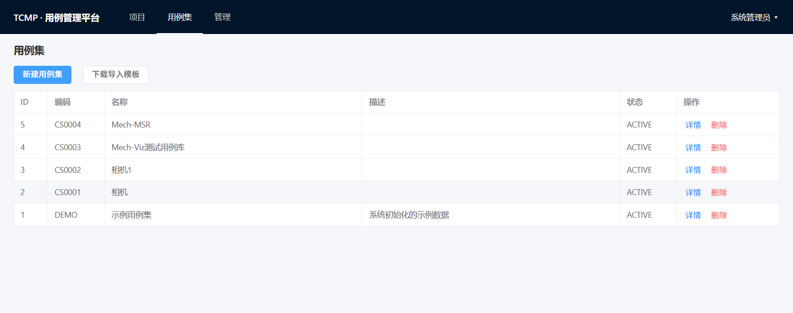

### 5.3 编写用例

在用例集详情页：

- **左侧模块树**：双击**子模块 / 子功能 / 测试项**名称可重命名；**拖动**名称可调整同级顺序或拖入上一级节点；点击 ➕ 新增用例；✏️ 批量管理。
- **批量新增**：点工具栏「批量新增」一次录入多条。
- **导入 Excel**：先「下载导入模板」（在用例集列表页），按模板填写后点「导入 Excel」。
- **导出 Excel**：将当前用例导出备份。
- **搜索**：右上输入框按标题/编号搜索。

用例字段：编号、模块路径、标题、等级、类型、阶段、标签、版本、前置条件、测试步骤、测试数据、预期结果。

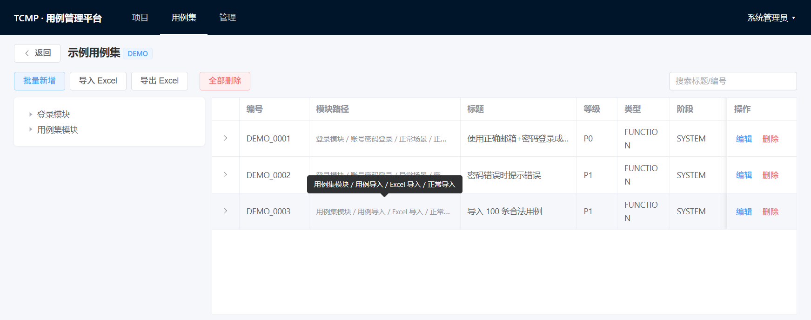

---

## 6. 项目管理

顶部导航点击「**项目**」进入。

### 6.1 新建项目

点「**新建项目**」，填写**项目名、描述**（项目 Key 自动生成，无需手填）、**Teambition URL**，创建。

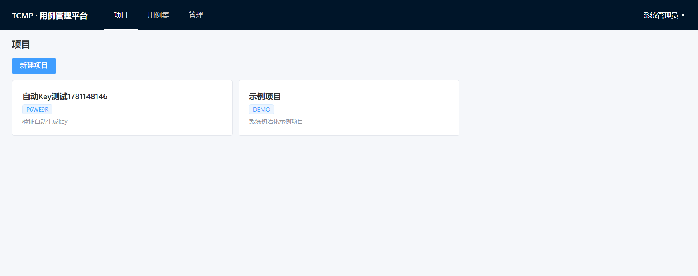

Teambition URL 为 TB 上需要提交缺陷的分组：如下所示

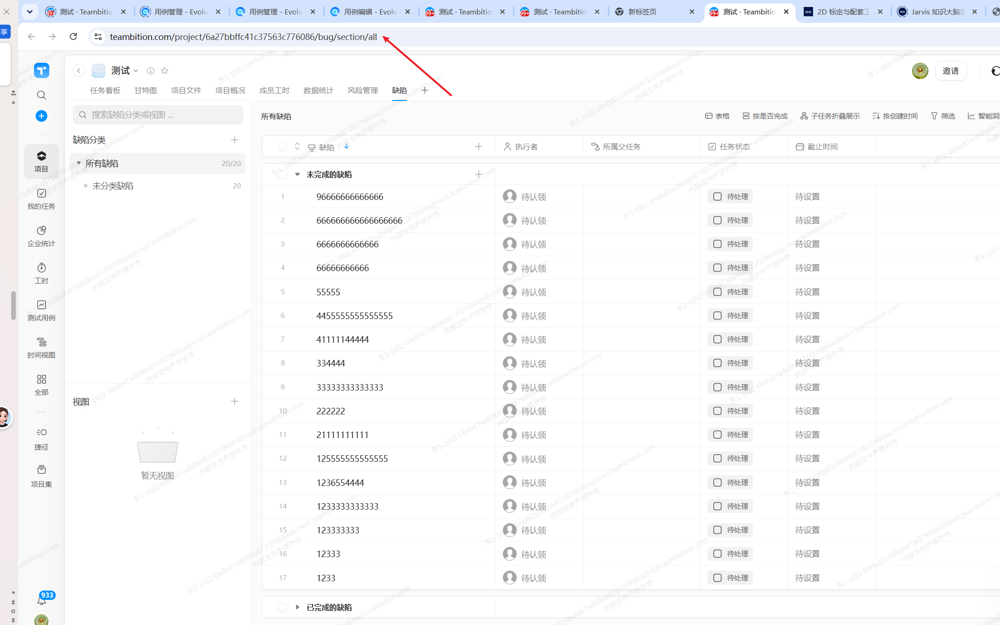

### 6.2 项目详情页

进入项目后有 5 个标签页：

| 标签 | 作用 |
|------|------|
| **用例池** | 从用例集添加/移除用例，是轮次的取材来源。 |
| **测试轮次** | 新建并管理本项目的测试轮次。 |
| **成员** | 添加项目成员并分配角色。 |
| **缺陷看板** | 查看本项目缺陷统计与列表。 |
| **设置** | 修改项目名/描述，配置 Teambition 链接。 |

### 6.3 维护用例池

在「**用例池**」标签：

- 点「**从用例集添加**」→ 选择用例集中的用例加入项目。
- 点用例行「移除」或「全部删除」清理用例池。

### 6.4 添加成员

在「**成员**」标签点「**添加成员**」，选择用户并指定角色。

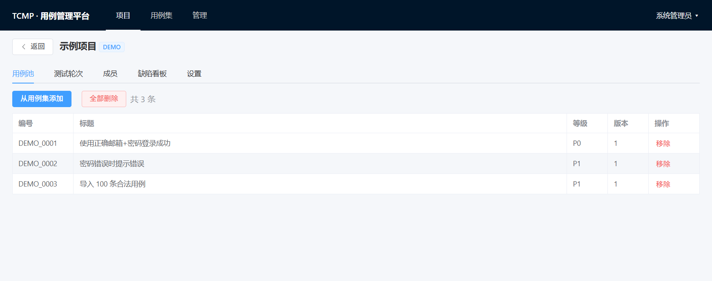

### 6.5 删除子项目 / 模块功能测试项目

在项目详情页「**子级项目**」标签（卡片或列表视图）中，可对子项目、模块功能测试项目点「**删除**」（内置项目除外）。

| 删除对象 | 前置条件 |
|----------|----------|
| **子项目** | 须先删除其下全部「模块功能测试项目」。 |
| **模块功能测试项目** | 须先删除或关闭其下全部测试轮次；项目用例池中的引用会一并清除。 |

删除前会弹出确认框；条件不满足时系统会提示具体原因。

---

## 7. 测试轮次

在项目详情页「**测试轮次**」标签。

### 7.1 新建轮次

1. 点「**新建轮次**」，填写轮次名、**被测软件版本**等信息。
2. 创建后状态为 `DRAFT（草稿）`。

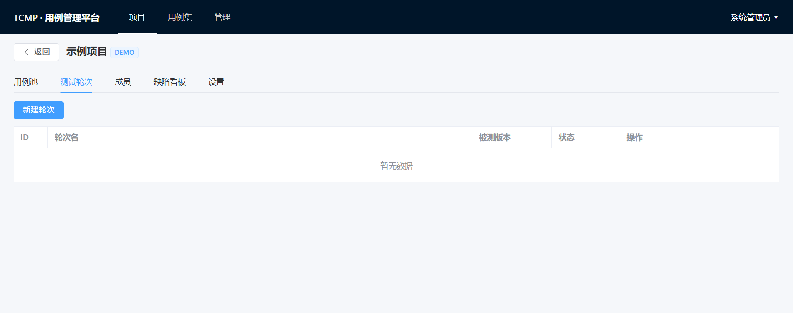

### 7.2 轮次详情与配置

点轮次行「**详情**」进入：

- **用例筛选**：按模块/等级/标签等条件，从用例池筛选本轮要测的用例。
- **分配**：将用例分配给不同成员执行。
- **发布**：草稿/暂停状态点「发布」→ 状态变 `IN_PROGRESS（进行中）`，成员即可执行。
- **暂停 / 关闭轮次**：进行中可暂停或关闭。

轮次状态：`DRAFT 草稿` → `IN_PROGRESS 进行中` → `PAUSED 暂停` / `CLOSED 关闭`。

### 7.3 双击重命名轮次

在模块功能测试项目详情页的「测试轮次」列表中，**双击轮次名称**可进入行内编辑：Enter 或点击空白处保存，Esc 取消。名称不能为空，最长 64 字。

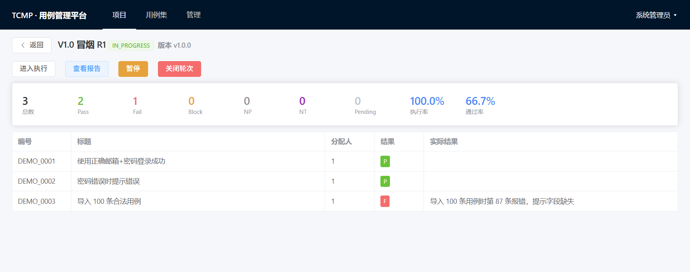

---

## 8. 执行用例

在轮次详情点「**进入执行**」，或项目轮次列表点「执行」。

### 8.1 执行界面

- **左侧**：用例树，可按 标题/编号 搜索，或按结果（全部/待执行/P/F/B）筛选。绿/红/黄数字代表通过/失败/阻塞数量。
- **右侧**：当前用例详情（前置条件、步骤、测试数据、预期结果），如有上一轮结果会显示提示。

### 8.2 记录结果

1. 阅读用例步骤进行测试。
2. 在「**实际结果**」「**备注**」填写说明（失败/阻塞时实际结果必填）。
3. 点击结果按钮：
   - **P 并跳到下一条 →**（推荐，通过后自动跳转）
   - **Pass (P) / Fail (F) / Block (B) / NP / NT**

### 8.3 关联缺陷

执行失败时，在「**关联缺陷**」区域：

1. 系统生成缺陷草稿（状态「待关联」）。
2. 在 Teambition 提交 Bug 后，复制任务 URL 粘贴到草稿行输入框。
3. 点「**关联**」完成绑定。

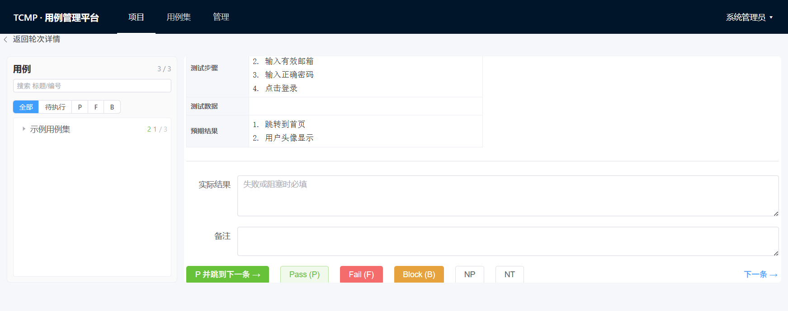

---

## 9. 用例评审

顶部导航「**用例集**」→ 进入用例集 → 可发起或参与用例评审（也可从工作台「待办评审」进入）。

评审流程概要：发起评审 → 成员逐条/整体留意见 → 发起人或负责人修订用例 → 关闭评审。

### 9.1 导出评审意见

在**评审详情页**右上角点「**导出评审意见**」，可下载 Excel，包含：

- **评审概要**：标题、状态、用例集、成员、用例数、意见数等；
- **用例与意见**：每条意见一行，并附带对应用例的编号、名称、等级、模块、步骤、预期结果等；
- **整体意见**：不针对单条用例的总体建议。

仅评审**发起人**与**评审成员**可导出（与查看评审详情权限一致）。

---

## 10. 缺陷管理

在项目详情「**缺陷看板**」标签查看：

- 顶部卡片：缺陷总数 / 未关闭 / 已关闭 / 本周新增。
- 图表：按严重程度、状态、时效（Aging）分布，以及近 30 天新增趋势。
- 缺陷列表：支持「关联 TB」「删除」操作；已关联的可点链接跳转 Teambition。

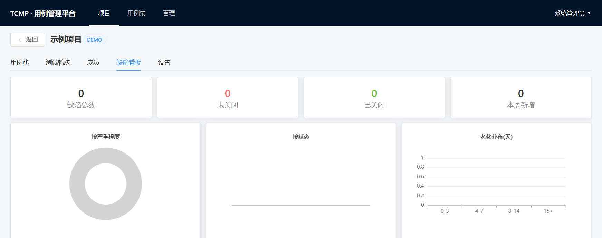

---

## 11. 查看报告

在轮次详情或执行页点「**查看报告**」。

报告包含：

- **汇总**：用例总数、Pass、Fail、Block、执行率、通过率。
- **模块测试充分性**：本轮 / 累计充分性，颜色标识（绿≥90% / 黄≥30% / 红<30%）。
- **人员维度**：每位执行人的分配数、P/F/B、通过率。
- **缺陷汇总**：本轮关联的缺陷列表。

点右上「**导出 Excel**」可下载报告。

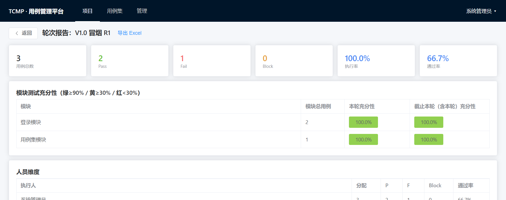

---

## 12. 系统管理（管理员）

仅**系统管理员**可见顶部「**管理**」菜单，含 3 个标签：

| 标签 | 作用 |
|------|------|
| **用户** | 查看所有用户、邮箱、系统角色、状态。 |
| **集成配置** | 配置 Teambition / 钉钉等集成参数。 |
| **钉钉推送日志** | 查看消息推送记录与状态。 |

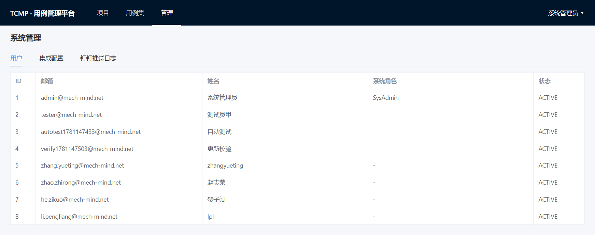

---

## 13. 常见问题

**Q：登录后为什么不是项目页？**
A：平台默认进入「工作台」，方便先看待执行与待办评审；顶部导航仍可进入「项目」。

**Q：为什么删不了某个用例集？**
A：只有该用例集的创建者或系统管理员可删除整个用例集；请联系创建者或管理员。

**Q：注册提示邮箱不合法？**
A：邮箱必须是公司域名 `@mech-mind.net`。

**Q：成员看不到轮次/无法执行？**
A：确认轮次已「发布」（状态为进行中），且该成员已被「分配」用例。

**Q：缺陷一直是「待关联」？**
A：需在 Teambition 创建任务后，把任务 URL 粘贴到缺陷行并点「关联」。

**Q：用例改了，轮次里还是旧的？**
A：用例池/轮次会“钉住”加入时的版本，重新执行或重新筛选可获取最新版本。

**Q：报告数据不准？**
A：执行率/通过率按已执行用例实时计算，刷新页面即可获取最新统计。

---

_文档作者：zhangyueting　|　如平台界面有更新，以实际页面为准。_
